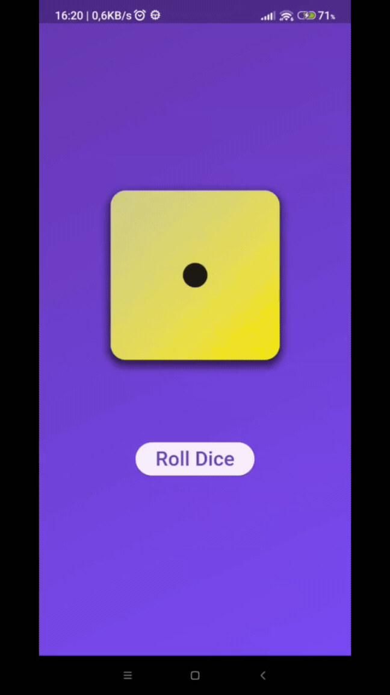

### Hi there, I'm Massimo Briceno 👋

<!--
**massimo-briceno/massimo-briceno** is a ✨ _special_ ✨ repository because its `README.md` (this file) appears on your GitHub profile.

Here are some ideas to get you started:

-  ...
-  ...
- 👯 I’m looking to collaborate on ...
- 🤔 I’m looking for help with ...
- 💬 Ask me about ...
- 📫 How to reach me: ...
- 😄 Pronouns: ...
-  Fun fact: ...
-->

## About me

From Venezuela to Italy and meshed up origins as well I just acquired a passion for cultures and visiting new places of our Beautiful Earth. In this little corner of the globe I have stepped on, I can immaturely and humbly say a journey it's just about people and mine's been fortunatly full of joyfully unexpected ones. It's never been about the finish line for me but truly only about the becoming of unknown tracks. Currently reside in Umbria, Italy. <em>I'm a Software Engineer, Data Scientist and a geek</em> and in the meantime I'm about to complety my first year of my MSc degree.

## I’m currently working on 🔭

1.  - decription: _Web and mobile platform for advertising publication_;
    - role: **Project Manager & Scrum Master, Software Architect**;
2.  - decription: _Management Dashboard for a Civil Engineering and Architecture company_;
    - role: **Project Manager & Scrum Master, Software Architect**;
3.  - decription: _Vehicle Charging system with the Flutter framework for a blowing local company in the Green Mobility and Energy Sector_;
    - role: **Lead Front-End , Mobile Dev, Back-End Dev**;
    - systems: web dashboard, multiplatfrom Mobile App;
    - tech stack: Flutter, Django, Docker.

## Technologies I’m currently learning 🌱:

Django...

## Near Future ⚡...

1. React
2. Angular
3. ... to be continued ...

## Flutter Projects

### Rolldice App

  
  

